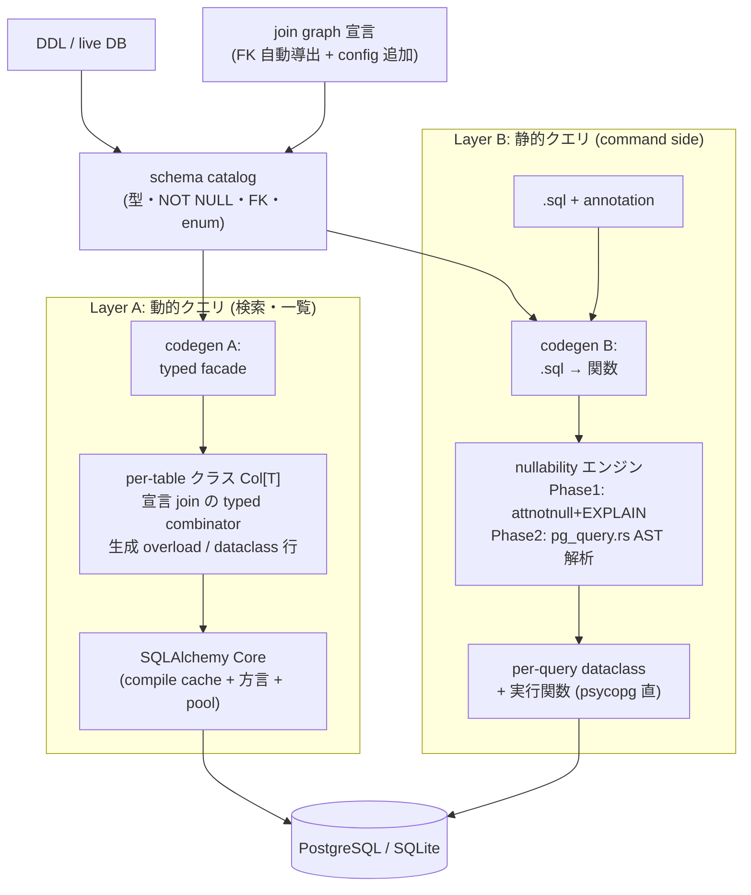
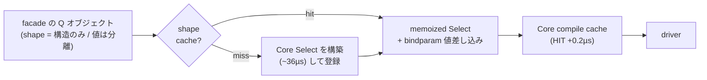
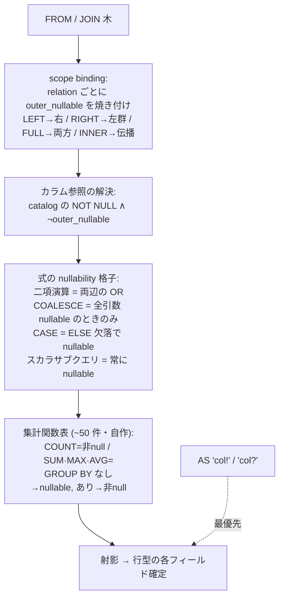
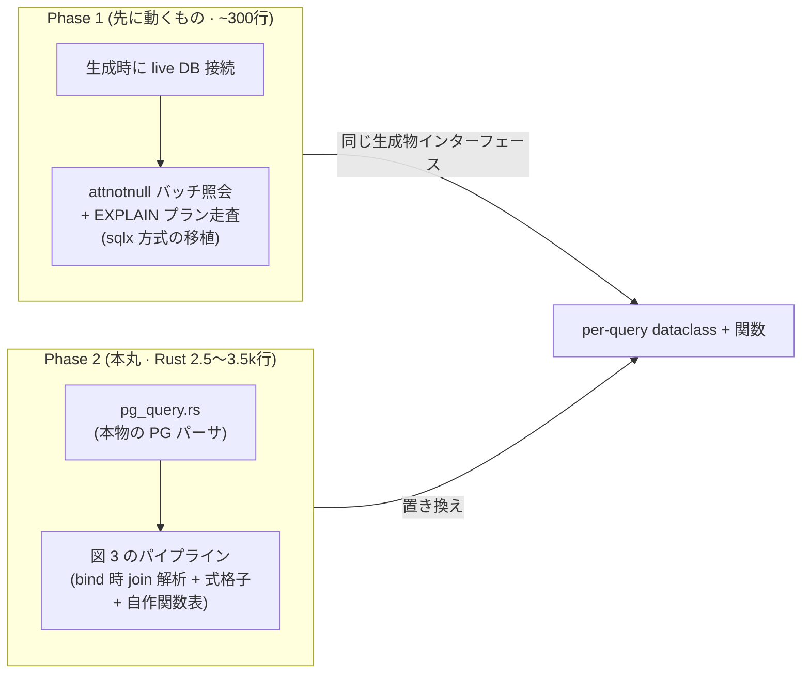

> HTML 版 (artifact): https://claude.ai/code/artifact/b66adab0-c25c-4e0d-add8-84a8a1959035

# alt-SQLAlchemy 設計書

Design Doc · v3 · 実験完了 2026-08-24

jOOQ 型アプローチによる型安全 SQL レイヤを Python でどこまで作れるか。前提となる設計原則と参考システム (sqlc / jOOQ / Kysely / sqlx / SQLAlchemy) の解剖は、別冊 [SQL クライアント設計原論](https://claude.ai/code/artifact/658fa160-4baf-4fb4-8954-6d537ce9a854) を参照。

## ゴール

**ゴール**: スキーマ (DDL) からのコード生成を第一級に据えた、型安全な SQL レイヤを Python に作る。到達目標は 3 つ — **Kysely 級の型安全** (LEFT JOIN を通した nullability が結果型に現れる)、**jOOQ 級の合成可能性** (述語・クエリ片を型を保ったまま部品化)、**sqlc 級のワークフロー** (migration を持たず、外部管理スキーマに対して生成)。

**非ゴール**: migration / ORM (unit of work・identity map) / 全 RDB 対応 (PG 第一級、SQLite は開発用) / WHERE 句による型 narrowing (Kysely も意図的に非対応)。

## 0. 実験結果 (2026-08-24 完了・全マイルストーン独立監査済み)

**結論: 本設計の賭けはすべて証明された。** M1 (型設計の手書き証明) → M2 (Layer A 生成器) → M0 (Rust ツールチェーン GO) → M3 (Layer B Phase 1 + コーパス) → M4 (Rust 静的解析器) → M5 (統合・ベンチ) の全工程を、事前定義ゲート + 実装 + 第三者エージェントによるゼロからの再検証、の三段判定で完了。

| 賭け | 結果 |
|---|---|
| operand 検査 + join nullability は生成で実現できる | ✓ M1 手書き証明 → M2 生成器が完全再現 (共有 reveal_type 53 式 byte 一致)、pyright strict 0 エラー |
| nullability は per-alias フラグ + 固定規則で足りる | ✓ Layer A (宣言 join graph) / Layer B (AST 解析) の両方で成立 |
| bind 時計算で sqlc を超えられる | ✓ M4: コーパス 94/94 カラム全問正解 (UNSOUND 0・safe-FP 0)、sqlc は同コーパスで 6+ カラム unsound (行番号引用付き台帳) |
| Rust build-time CLI は配布可能 | ✓ 2,539 行、musl 静的 5MB、解析 0.065ms/query、決定的出力 |
| 2 レイヤは 1 アプリに合成できる | ✓ M5: 統合デモ 54 検証 0 失敗。Layer B は手書き psycopg 比 +2%、Layer A は Core 比 +57µs |

**発見 3 件**: (1) sqlx の LEFT JOIN 推論の unsoundness (プランナの Left→Right 反転で規則が逆転する統計依存バグ、upstream 未報告)。(2) sqlc divergence ledger (INNER の `prior` 破棄・derived table/LATERAL 素通り・関数表 nullable 注釈ゼロ、行番号付き)。(3) 「正解付きコーパスは、含まれない入力形状を検査できない」— M4 edge probe と M5 統合テストのみが捕捉したバグが各 1 件 (M2 の enum WHERE バインド欠陥など)。静的証明・コーパス・統合実行の三層が全部必要。

**未解決 (friction log 22 項目の要点)**: パッケージング、2 レイヤの共有トランザクション、enum の二重表現、Layer A の RETURNING 欠如、HAVING/window/self-join、discriminator の typed union。SQLAlchemy 2.1 は final 未リリースで、差別化 4 点はすべて upstream で未解決のまま。

成果物: `alt-sqlalchemy-m0/`〜`m5/` (各 README + evidence)、`sqlacodegen-trial/`、本書。

## 1. 設計原理 — 別冊からの結論

別冊で導いた原則のうち、本設計を規定する 4 つ:

- **Python で静的型に到達する道はビルド時生成のみ**。TS の mapped types に相当する型レベル計算が存在せず、pyright はプラグインも拒否。型検査時に TS が計算するものを、生成器が事前列挙してコードとして書き出す。事前列挙できないもの (任意の動的 join) は型付けを放棄する。
- **nullability は式の中で流さず、宣言された境界で一括計算する** (jOOQ #10212 の教訓)。Kysely の実装が示す通り、必要なのは table-alias 単位の nullable フラグ + 固定ルール表だけで、汎用型推論エンジンは不要。
- **行型は named-object (dataclass) を主にする**。jOOQ の Record22・SQLAlchemy の 10 カラム上限は「タプル位置型 + 手書き overload」の帰結であり、名前付き型なら壁が存在しない。
- **SQL 生成・実行層は自作しない** (再実装コスト実測 ~95k LOC)。SQLAlchemy Core を型的に隠蔽された compile backend として使う (+2µs/query、MIT、ORM 非依存を確認済み)。手動オーバーライド (`"col!?"`) は第一級機能として最初から仕様に入れる。

## 2. 全体像: 2 レイヤ・1 型モデル



*図 1: 全体アーキテクチャ。カタログ・型マッピング・nullability 規則・行型の設計を両レイヤで共有する*

「SQL を事前に型検査する」ことと「実行時にクエリを合成する」ことは原理的に衝突する (別冊 1.3)。この緊張を 1 つの仕組みで解こうとせず、ワークロードで切り分ける: **動的な検索・一覧 (CQRS の query side) は Layer A** の宣言済み join 上の合成で、**確定形のトランザクション (command side) は Layer B** の verbatim SQL で受ける。両者は同じ DB 接続上に同居できる。

## 3. Layer A — 生成される typed facade の解剖

#### 入力: スキーマ + join graph 宣言

```toml
# joins.toml — 「実アプリの join は有限で宣言可能」がこのレイヤの賭け
[[join]]
from = "orders"; to = "users";        on = "orders.user_id = users.id"   # FK から自動導出
[[join]]
from = "orders"; to = "order_items";  on = "order_items.order_id = orders.id"
```

#### 出力 1: テーブルクラス — 通常版と Nullable 版の 2 態

```python
# generated
class _OrdersCols:
    id:      Col["orders", UUID]
    status:  Col["orders", OrderStatus]     # PG ENUM → 生成 enum
    total:   Col["orders", Decimal]

class _OrdersColsN:                          # LEFT JOIN の非保存側に立ったときの姿
    id:      Col["orders", UUID | None]      # Kysely の Nullable<T> を「事前計算」した形
    status:  Col["orders", OrderStatus | None]
    total:   Col["orders", Decimal | None]

ORDERS = _OrdersCols()
```

Kysely が型検査のたびに `Nullable<T>` mapped type で計算するものを、生成時に `_XxxColsN` として物質化する。これが「推論を生成で置き換える」の具体形である。

#### 出力 2: 演算子は生成メソッド — SQLAlchemy の 2 大穴を構造的に塞ぐ

```python
ORDERS.status.eq(OrderStatus.PAID)   # Pred    — eq(value: OrderStatus)
ORDERS.status.eq("paid")             # 型エラー! (SQLAlchemy の == Any 穴が存在しない)
ORDERS.total.mul(3)                  # Expr[Decimal] — 結果型は生成時に決定済み。
                                     # オペランド順問題 (Eder の狂気) は、式中で
                                     # nullability を「流さない」ので最初から起きない
```

dunder (`__eq__`) を使わないのは意図的である。Python の dunder は右辺の型で overload を縛れず (`object` を受けざるを得ない)、jOOQ 型の operand 検査はメソッド形式でしか成立しない。

#### 出力 3: 宣言 join だけが型付き combinator になる

```python
q = (from_orders()                       # Q[orders]
     .left_join_users())                 # Q[orders, users∅]  ← 生成メソッド。
                                         #   以後 users は _UsersColsN として見える
rows = (q.where(ORDERS.status.eq(OrderStatus.PAID))
         .select(ORDERS.id, q.users.email)          # Select2[UUID, str | None]
         .fetch(conn))                              # list[tuple[UUID, str | None]]
```

述語・クエリ片は値なので合成できる — 動的検索はここで書く:

```python
def search_orders(f: OrderFilter) -> Pred:
    preds: list[Pred] = []
    if f.status:   preds.append(ORDERS.status.eq(f.status))
    if f.since:    preds.append(ORDERS.created_at.gte(f.since))
    return all_of(*preds)          # 空なら no-op (jOOQ の noCondition と同じ意味論)
```

宣言されていない join は型付き API に存在しない (メソッドが生成されない)。任意 join は型安全を明示的に放棄する escape hatch のみ提供する — Kysely が動的テーブル名で型を全崩壊させるのと同じ線引きを、生成の有無で表現する。

#### 出力 4: 行型 — named-object 主体で arity の壁を消す

```python
# 頻出射影は宣言して dataclass を生成
@dataclass(frozen=True, slots=True)
class OrderSummaryRow:          # generated
    order_id: UUID
    user_email: str | None      # ← left join 由来。宣言 join graph から自動で | None
    total: Decimal
```

アドホック射影用の `select()` overload も生成物なので、本数は設計変数 (32 本でもよい)。SQLAlchemy 2.1 の `__row_pos__` / PEP 646 により `Row` は型上 tuple なので、tuple 経路でも `row[0]` が `Any` になる旧来の穴はない。

#### 実行: Core への変換と statement memoization



*図 2: 実行経路。Core の compile cache は「statement を作り直すと毎回 ~54µs 払う」性質があるため、shape と値の分離を生成コードの標準にして生成側で吸収する*

公開 API に SQLAlchemy の型 (`Select` / `Row` / `Any`) は一切露出させない。内部表現には 2.1 の `TypedColumns` / `__row_pos__` 互換宣言を emit し、Core との境界でも型を保つ。

#### escape hatch (第一級機能)

```python
q.users.email.not_null()       # 手動で | None を外す (Kysely $notNull 相当)
raw_pred(text("..."), params)  # 型保証を放棄して任意 SQL 片を差す (明示的に unsafe)
```

## 4. nullability エンジン — 両レイヤ共有の核



*図 3: bind 時計算のパイプライン。sqlc の 65 行の意味論を scope binding に移すことで、sqlc が誤る右結合ネスト・derived table・LATERAL が構造的に正しくなる (別冊 2.3)*

sqlc の `isTableRequired` をカラム毎の再走査 (post-hoc) から bind 時のフラグ焼き付けに移した擬似コード:

```python
def bind_from(scope: Scope, node: FromNode, outer_nullable: bool) -> None:
    match node:
        case RangeVar() as t:                       # 葉 = テーブル参照
            scope.add(t.alias or t.name, table=t, outer_nullable=outer_nullable)
        case JoinExpr(kind, left, right):
            match kind:
                case "LEFT":  bind_from(scope, left,  outer_nullable)
                              bind_from(scope, right, True)
                case "RIGHT": bind_from(scope, left,  True)
                              bind_from(scope, right, outer_nullable)
                case "FULL":  bind_from(scope, left,  True)
                              bind_from(scope, right, True)
                case "INNER": bind_from(scope, left,  outer_nullable)   # ← prior を捨てない。
                              bind_from(scope, right, outer_nullable)   #   sqlc のバグはここが原因
        case RangeSubselect() as s:                 # derived table / LATERAL も同じ規則で流す
            inner = analyze_select(s.subquery)      #   (sqlc は case 自体がなく素通りしていた)
            scope.add(s.alias, columns=inner.columns, outer_nullable=outer_nullable)

# カラム解決は 1 行になる:
#   nullable = (not col.attnotnull) or scope[alias].outer_nullable
```

Layer A では join graph が宣言済みなので、この計算は**生成時に完了**し、結果が `_XxxColsN` クラスとして焼き込まれる (実行時コストゼロ)。Layer B では .sql ごとにこのパイプラインを回す。sqlc 新コアの式格子 (742 行) は移植し、関数表だけは自作する — sqlc の PG 関数表 2,782 件には nullable 注釈が 1 件もなく、ここが最安の差別化点になる:

```jsonl
// functions_nullability.jsonl (自作・抜粋)
{"name":"count",  "nullable":false}
{"name":"sum",    "nullable":true,  "not_null_when":"grouped"}   // GROUP BY があれば各グループ非null
{"name":"max",    "nullable":true,  "not_null_when":"grouped"}
{"name":"coalesce", "rule":"first_not_null_arg"}                 // 引数規則で決まる特殊形
```

## 5. Layer B — 静的クエリの形

```sql
-- queries/orders.sql
-- QUERY get_order_with_user :one
SELECT o.id, o.total, u.email AS "email?"      -- オーバーライドは第一級
FROM orders o
JOIN users u ON u.id = o.user_id
WHERE o.id = ${order_id};
```

```python
# generated
@dataclass(frozen=True, slots=True)
class GetOrderWithUserRow:
    id: UUID
    total: Decimal
    email: str | None          # "email?" オーバーライド由来

def get_order_with_user(conn: Connection, *, order_id: UUID) -> GetOrderWithUserRow | None: ...
```

SQL は placeholder 置換以外一切書き換えずに実行する (verbatim)。annotation 文法は SQG のもの (`-- QUERY name :one` / `@set` / `${var}` / `BASELINE` — SQL 本体をオペークに保ち、変数参照と文字列リテラルだけ字句で拾う) を踏襲する。nullability は 2 段階で進化させる:



*図 4: Layer B の 2 段階。Phase 1 は精度を EXPLAIN に委ね早く動かし、Phase 2 で AST 解析に置き換える。生成物の形は最初から共通*

CQRS では command side がこのレイヤに自然に収まる。identity map を持たないので、SQLAlchemy ORM で実測した UPSERT の stale 問題 (RETURNING しても identity map の古い値が返る) は構造的に起きない。

## 6. 型システムの到達ライン (対既存システム)

| 性質 | 本設計 | SQLAlchemy 2.1 | jOOQ | Kysely |
|---|---|---|---|---|
| operand 型検査 | ✓ 生成メソッド | ✗ (`== Any`) | ✓ | ✓ |
| LEFT JOIN → \| None | ✓ 宣言 graph (A) / AST 解析 (B) | ✗ (Nullable() 手動) | ✗ (設計判断で拒否) | ✓ (型推論) |
| 行アクセスの型 | ✓ dataclass / tuple (PEP646) | △ tuple 化のみ・名前アクセス不可 | △ Record22 まで | ✓ |
| 射影 arity 上限 | ✓ なし (named-object) | 10 (明示列挙時) | 22 | ✓ なし |
| 集計関数 nullability | ✓ 自作表 (GROUP BY 有無を区別) | ✗ | ✗ | △ 手動 opt-in |
| カラム名 typo 検出 | ✓ | △ values()/constructor 素通り | ✓ | ✓ |
| 任意 (非宣言) join | ✗ escape hatch のみ | ✓ (型は劣化) | ✓ (型は join 非依存) | ✓ |
| WHERE narrowing | ✗ (意図的非対応) | ✗ | ✗ | ✗ |
| 動的クエリ合成 | ✓ 宣言 path 内で | ✓ | ✓ | ✓ |

## この設計の賭けと差別化

**賭けは 1 つ** — **「実アプリの join は有限で宣言可能」**。これを受け入れると、Kysely が型推論でやることを生成の事前列挙で再現でき、集計 nullability と bind 時 join 解析の正確さで**既存のどのシステムの上にも出られる**。差別化は SQLAlchemy 2.1 が来ても埋まらない 4 点: operand 検査 / join nullability / 型付き集計 / 検証済みアクセス。逆にこの賭けが外れる (join を宣言しきれない) アプリでは、本設計は SQLAlchemy Core に対する優位を失う。

## 7. 主要リスク (要点のみ)

- **SQLAlchemy 2.1 の領域侵食** — TypedColumns で「typed table.c」の価値は消滅済み。上記 4 点に集中し、2.1 の機構はむしろ内部実装として利用する
- **compile cache の静かな性能崖** — statement memoization を生成コードの標準にし、ベンチで CACHE_HIT を assert
- **pg_query.rs のビルド脆弱性 / PG18 遅延** — 代替: Go (sqlc の oliphant) or 解析のみ Python (pglast)。Prisma の教訓により Rust は build-time CLI に限定し、runtime には置かない
- **推論の不完全性** — false positive (過剰 `| None`) 側に倒し、`"col!?"` オーバーライドで受ける (sqlx と同判断)

---

Draft v2 · 別冊: [SQL クライアント設計原論](https://claude.ai/code/artifact/658fa160-4baf-4fb4-8954-6d537ce9a854) · ソース: `design/` (python-sandbox worktree) · 実測証跡: `sqlacodegen-trial/`
