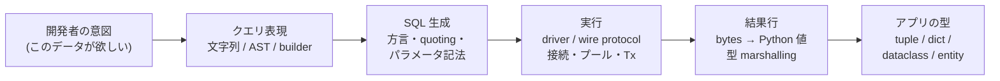
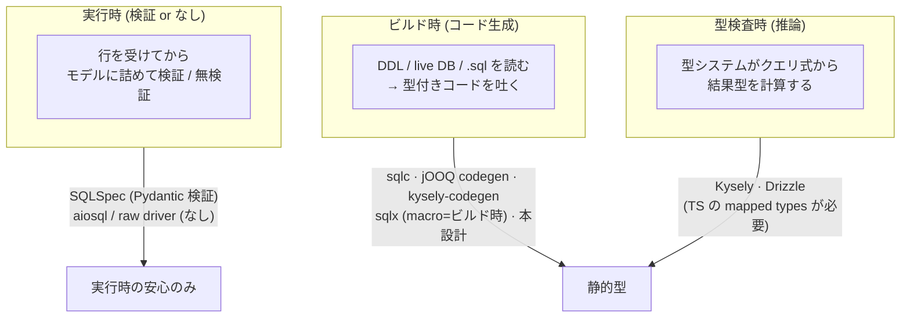
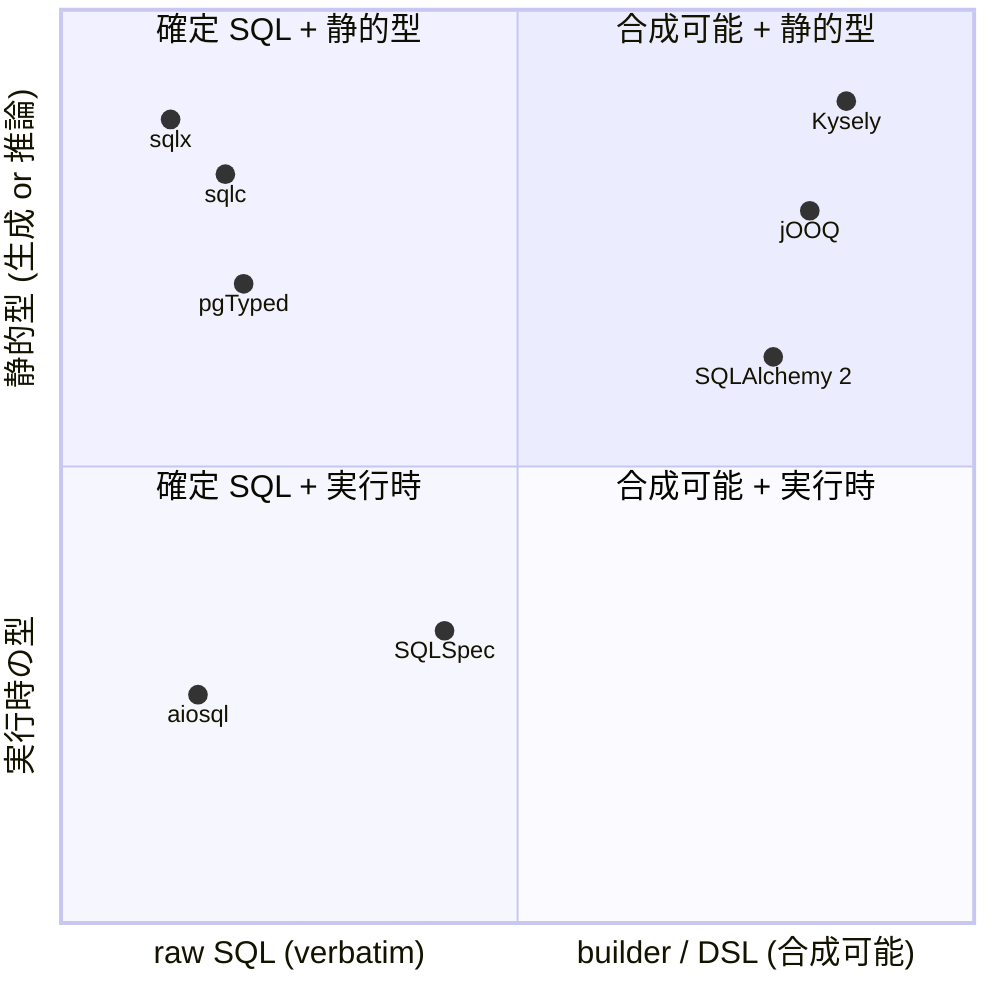
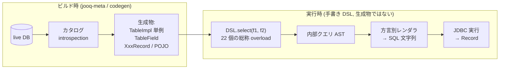
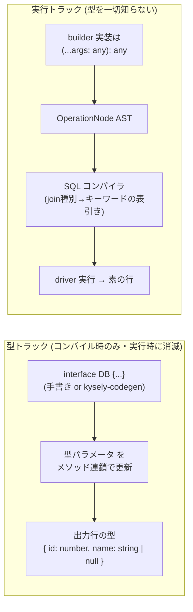
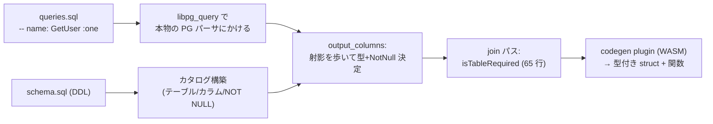
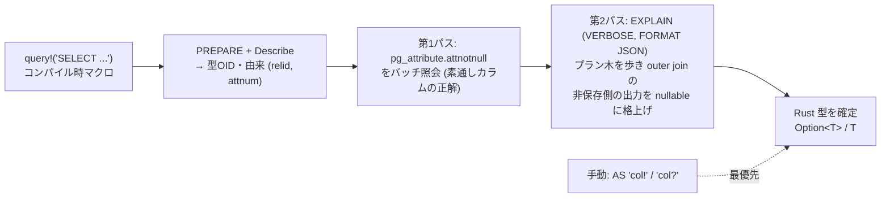
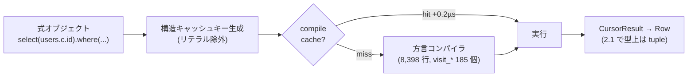

> HTML 版 (artifact): https://claude.ai/code/artifact/658fa160-4baf-4fb4-8954-6d537ce9a854

# SQL クライアント設計原論

Reference · 2026-08-23

database client を「作る側」から見るための原則と、sqlc / jOOQ / Kysely / sqlx / SQLAlchemy のアーキテクチャ解剖。alt-SQLAlchemy 設計書の背景編。

## PART I: database client を設計するための原則

「client を使う側」から見えるのは API だけだが、作る側から見るとどの client も同じ 1 本のパイプラインである。設計とは、このパイプラインの各段を**誰が・いつ・何の情報を使って**処理するかを決めることに等しい。

### 1.1 すべての client が持つパイプライン



*図 1: SQL client の普遍パイプライン。全システムはこの 5 段の実装方式の組合せで説明できる*

各段には見た目以上の仕事がある。SQLAlchemy Core の実装を精読した実測では、この「見えない仕事」の総量は約 95k LOC あった:

| 段 | 見えない仕事の例 |
|---|---|
| SQL 生成 | 識別子 quoting (予約語は方言毎に 100〜280 語)、パラメータ記法が 6 種 (`?` `%s` `%(name)s` `:name` `:1` `$1`)、LIMIT が `TOP`/`FETCH FIRST`/ROW_NUMBER 書き換えに化ける方言、UPSERT 構文が 3 系統、空 IN 句の安全な展開 |
| 実行 | 接続プール、トランザクション境界、bulk INSERT のバッチ化 (insertmanyvalues: N 往復 → N/1000 往復、RETURNING の順序保証つき) |
| 結果 | `cursor.description` → カラム位置の突合 (戦略が 4 種類)、Decimal/datetime/JSON/UUID の双方向変換、SQLite のように日付型が存在しない DB の ISO-8601 往復の手実装 |

ここから最初の原則が出る: **SQL 文字列の生成と実行は自作しない**。この 2 段は差別化にならない消耗戦で、既存の実績あるレイヤ (SQLAlchemy Core、または raw SQL なら driver 直) に委譲する。作る価値があるのは残りの段 — **クエリ表現と型**である。

### 1.2 設計軸 1 — 型情報をいつ手に入れるか

「型安全な client」と一口に言っても、型情報を獲得するタイミングで族が分かれる。これが最重要の設計軸である。



*図 2: 型獲得タイミングの 3 族。静的型に到達できるのはビルド時と型検査時のみ*

- **型検査時の推論**は最も体験が良い (Kysely)。ただし「N 個のカラム引数から結果タプル型を計算する」「LEFT JOIN でオブジェクト型の全プロパティを `| null` に写像する」といった**型レベル計算** (mapped / conditional types) が言語に必要で、**Python には存在しない**。pyright はプラグイン機構も拒否している。この道は Python では閉じている。
- **実行時検証**は「宣言した型に合うはず」を実行時に確かめるだけで、SQL と型の静的な結びつきはない (SQLSpec の `select_one(sql, schema_type=User)` は SQL が何を SELECT していても型検査を通る)。
- よって Python で静的型に到達する道は**ビルド時生成のみ**。型検査時に TS がオンデマンドで計算するものを、生成器が事前に列挙してコードとして書き出す。これは制約でもある — **事前列挙できないもの (任意の動的 join) は型付けできない**。

### 1.3 設計軸 2 — クエリをどう表現するか

| 表現 | 合成可能性 | SQL の忠実さ | 型付けの難度 | 代表 |
|---|---|---|---|---|
| **raw SQL 文字列** | なし (静的に確定) | verbatim — 書いた SQL がそのまま飛ぶ | クエリ単位の解析が必要だが、**解析対象が確定している**ので正確にできる | sqlc, sqlx, aiosql |
| **builder / DSL** (式の木を組む) | 高い — 述語やクエリ片を値として合成 | △ 生成器の品質次第 | 合成のすべての中間状態に型を与える必要があり、**組合せが開く** | jOOQ, Kysely, SQLAlchemy Core |
| **ORM** (オブジェクトグラフ + unit of work) | 高い | △ + 暗黙のクエリ (lazy load, flush) | 同上 + 状態管理の罠 (identity map の stale 等) | SQLAlchemy ORM, Hibernate |

ここに本質的な緊張がある: **「SQL を事前に型検査する」ことと「実行時にクエリを合成する」ことは原理的に衝突する**。raw SQL 系 (sqlc) の modularity の欠如は手抜きではなくこの衝突の帰結。逆に builder 系は合成の自由と引き換えに、型付けの対象が「書かれた SQL」から「組みうる全ての式」に爆発する。

### 1.4 なぜ nullability が最難関なのか

カラムの型そのもの (int か str か) はスキーマを見れば分かる。難しいのは **結果セットの nullability がスキーマではなくクエリの構造で決まる**ことだ:

```sql
CREATE TABLE users  (id uuid NOT NULL, email text NOT NULL);
CREATE TABLE orders (id uuid NOT NULL, user_id uuid NOT NULL);

SELECT u.email,      -- NOT NULL のまま
       o.id          -- スキーマ上 NOT NULL だが、この結果では NULL になりうる!
FROM users u
LEFT JOIN orders o ON o.user_id = u.id;   -- 注文のないユーザの行では o.* は全部 NULL
```

この事実を知る手段は 4 つしかなく、それぞれ知れることが違う。**どの情報源を選ぶかが nullability エンジンの設計そのもの**である:

| 情報源 | 分かること | 分からないこと | 採用例 |
|---|---|---|---|
| wire protocol | 結果カラムの型 OID、由来テーブル/カラム番号 | **nullability は一切運ばれない** (PG の RowDescription に not-null フラグがない) | 全システムの土台 |
| catalog (pg_attribute) | 由来カラムの `attnotnull` — 「素通しカラム」の正確な nullability | join・集計・式が作る NULL | sqlx 第 1 パス, sqlc DB analyzer |
| SQL の AST 解析 | join 木の構造から「どの relation が outer join の非保存側か」を厳密に判定。式の nullability 規則も適用可 | 実装した規則の範囲しか分からない (漏れ = バグ) | sqlc 静的解析 |
| planner (EXPLAIN) | DB 自身の実行計画から outer join の影響を読む — join 推論を DB に委譲できる | 出力形式が非公式で不安定。式・集計は文字列マッチ頼み | sqlx 第 2 パス |

> 実務上の合意事項がもう 1 つある: **自動推論は完璧にならない**。sqlx・pgTyped・sqlc は全員 `AS "col!"` / `AS "col?"` という手動オーバーライド構文を第一級機能として持つ。誤るなら false positive (過剰な `| None`) 側に誤り、escape hatch で直させる — これがこの分野の到達済みベストプラクティスである。

### 1.5 系譜マップ



*図 3: 右上 (合成可能 + 静的型) に Python のツールが存在しない — alt-SQLAlchemy 実験の存在理由*

## PART II: 参考システムのアーキテクチャ解剖

### 2.1 jOOQ — 「生成テーブル + 手書き総称 DSL」の原型



*図 4: jOOQ の 2 部構成。「テーブルは生成、DSL は手書き総称型」という分業*

```java
// 生成物 (1 テーブル = 1 単例 + 型付きフィールド)
public class Author extends TableImpl<AuthorRecord> {
    public static final Author AUTHOR = new Author();
    public final TableField<AuthorRecord, String> LAST_NAME = createField(...);
}

// 手書き DSL がそれを受ける — operand が本当に型検査される
AUTHOR.LAST_NAME.eq("Orwell")   // OK:  Field<String>.eq(String)
AUTHOR.LAST_NAME.eq(42)         // コンパイルエラー!  ← SQLAlchemy にない性質
```

**学ぶこと**: 演算子を「生成された型付きフィールドのメソッド」にすると operand 型検査が構造的に手に入る。**学ばないこと**が 2 つ:

- **Record22 の壁**。射影の結果を `Record2<T1,T2>` というタプル位置型で表すため、`DSL.select()` は 22 個の手書き overload で打ち止め (ソース確認済み、`Record23` は存在しない)。23 カラム目から untyped に落ちる。名前付きオブジェクト型 (dataclass) を主にすればこの壁は最初から存在しない。
- **join-blind な型**。`leftJoin()` は型パラメータを一切変えず、`TableField<R,T>` の T は生成時に固定。これは見落としではなく **Lukas Eder の設計判断**: 「自由に合成できる式 DSL の中で nullability を流すと、`i.add(j): Field<Int>` と `j.add(i): Field<Int?>` のようにオペランド順で型が変わる狂気に行き着く」(issue #10212)。SQLAlchemy の `quantity * unit_price → int` バグは、まさにこの狂気を stub の手抜きで実装してしまった実例である。**教訓: nullability は式の中で流さず、宣言された境界 (join site) で一括して計算する**。

### 2.2 Kysely — 型トラックと実行トラックの完全分離



*図 5: Kysely の 2 トラック。型は TS コンパイラへの「約束」であり、ランタイムには 1 バイトも存在しない*

核心は join の型変換で、抽出した全 33 ルールのうち本質は 4 つに畳める:

```typescript
type Nullable<T> = { [P in keyof T]: T[P] | null }   // TS の mapped type

// RULE-1..4 (join 種別 → per-alias の nullability)
leftJoin(B)   ⇒ DB' = { ...DB, B: Nullable<B> }        // 右側を全カラム | null
rightJoin(B)  ⇒ 既知の全テーブルを Nullable に、B はそのまま
fullJoin(B)   ⇒ 両方 Nullable
innerJoin(B)  ⇒ 変化なし
// 以後の select / where / orderBy は全部この DB' を参照する — 出力だけでなく全参照に効く
```

**学ぶこと**: (1) nullability は**式単位ではなく table-alias 単位のフラグ**で持てば足りる — 汎用型推論エンジンは不要で、生成器で事前計算できる形をしている。(2) 型層とランタイムは完全に分離できる。**Kysely 自身の限界**も学び: WHERE `IS NOT NULL` で narrowing しない、GROUP BY の影響を見ない、サブクエリ非空性を推論しない (スカラサブクエリは常に `| null`)、動的なテーブル名で型が全崩壊。本家はこれらを `$notNull()` / `$castTo` という手動 escape で運用している。

### 2.3 sqlc — raw SQL を AST 解析して型を生成する



*図 6: sqlc のパイプライン。パーサは PostgreSQL 本体のもの (libpg_query) — 方言忠実性の源泉*

評判の高い join nullability の正体は、たった 65 行のこの再帰である (概念形):

```go
// 出力カラムごとに FROM の join 木を歩き、「そのカラムの由来テーブルは必ず行を持つ側か?」を判定
func isTableRequired(node, col, prior) int {
    switch node {
    case RangeVar:                       // 葉 = テーブル参照
        if 名前/alias が col の由来と一致 { return prior }   // ここまで運んだ required/optional を返す
    case JoinExpr:
        switch node.Jointype {
        case LEFT:  return helper(左=required, 右=optional)  // LEFT JOIN の右側は optional
        case RIGHT: return helper(左=optional, 右=required)
        case FULL:  return helper(左=optional, 右=optional)
        case INNER: return helper(左=required, 右=required)  // ← バグ: 親から来た prior を捨てている!
        }
    }
}
```

**学ぶこと**: 解析の本体は小さい。**構造的な穴**が 3 つある —

- `a LEFT JOIN (b JOIN c ON ...)` のような右側ネストで `prior` が捨てられ、b と c が NOT NULL 扱いになる (testdata に `LEFT JOIN (` が 0 件 — テスト空白地帯)
- derived table (`LEFT JOIN (SELECT ...) s`) と LATERAL は `case` 自体がなく素通り
- PG 関数表 2,782 件に **nullable 注釈が 1 件もない** — `SUM`/`MAX`/`AVG` が空集合で NULL を返すことが型に出ない

原因は「出力カラムごとに join 木を再走査する後付けパッチ」という実装配置にある。同じ 65 行の意味論を **FROM 解決 (scope binding) の時点で各 relation に `outer_nullable` フラグとして焼き付ける**方式に移すと、ネスト・derived table・LATERAL が全部自然に正しくなる。sqlc 自身の次世代解析器 (internal/core) は式の nullability 格子 (742 行 — 二項演算 = 両辺 OR、COALESCE = 全引数 nullable のときのみ、CASE = ELSE 欠落で nullable、スカラサブクエリ = 常に nullable) を綺麗に作ったのに、join のこのフラグだけ未実装。**つまり「両方揃えたものはまだ世界に存在しない」**。

### 2.4 sqlx — 解析を DB のプランナに委譲する



*図 7: sqlx の 2 パス推論。SQL の文法解析はゼロ — join の推論を Postgres のプランナ自身にやらせる*

**学ぶこと**: この方式は全体で **302 行**しかなく、live DB に接続できる生成器なら join-aware nullability が「ほぼ無料」で手に入る。**代償**: EXPLAIN の JSON は非公式・不安定な形式で、カラムの突合が文字列一致 (集計・サブクエリ・CTE で外れうる)。外れたときは nullable 側に倒れる (安全だが過剰な `Option`)。パラメータを NULL で埋めてプランを取る都合上、`plan_cache_mode = force_generic_plan` の強制も必要になった (PR #3541) — プランナ委譲方式の脆さがよく現れている。

### 2.5 SQLAlchemy — 実行時式木の完成形と、型の後付けの限界



*図 8: SQLAlchemy Core の実行時アーキテクチャ。この部分は言語横断で見ても最高品質*

一方、型は 2006 年設計の動的 API への後付け (2023) であり、直せる穴と直らない穴がある:

- **直せる層 (stub の未整備)**: 演算子が左オペランドの型を返す (`quantity * unit_price → int`。ランタイムの型解決は順序非依存で正しく、stub だけが裏切っている) / `excluded` が `Any` / DML の `Result[Any]`
- **直らない層 (API 設計が型付け以前)**: `Row.__getitem__ → Any` / `values(**kwargs)`・コンストラクタ無検査 / `AliasedClass.__getattr__ → Any` (typo も素通り) / LEFT JOIN 非 narrowing は `Nullable()` 手動 opt-in が公式回答

ただし **2.1 (main) には `TypedColumns` / `__row_pos__` / PEP 646 の Row=tuple 化が入り**、テーブル単位の型宣言と行タプル型は自前で持てるようになった (しかも `__row_pos__` 経由なら 10 カラム上限なし)。SQLAlchemy 自身がこの領域に動いている、という事実も含めて参照点になる。

### 2.6 まとめ — 各システムの本質 1 行

| システム | 本質 | 最大の強み | 最大の弱み |
|---|---|---|---|
| jOOQ | 生成テーブル + 手書き総称 DSL | operand 型検査・SQL 網羅性 | Record22 の壁・join-blind な型 (設計判断) |
| Kysely | 型レベル計算 + type-erased ランタイム | join nullability を含む推論体験 | TS 専用 (mapped types 依存)・型は「約束」のみ |
| sqlc | raw SQL の AST 解析 → 生成 | 本物の PG パーサ・join 解析の意味論 | post-hoc パッチの穴・関数表の nullable 注釈ゼロ・合成不可 |
| sqlx | 解析をプランナに委譲 | 302 行で join-aware・SQL 文法知識ゼロ | EXPLAIN 形式への依存・文字列突合の脆さ |
| SQLAlchemy | 実行時式木 + 方言コンパイラ | SQL 生成・実行層の品質 (95k LOC の価値) | 型が後付けで、直らない穴が公開 API に露出 |

---

alt-SQLAlchemy 設計書の背景編 · 出典: 各リポジトリのソース精読 (sqlc output_columns.go / kysely select-query-builder.ts / sqlx describe.rs / jOOQ DSL.java / sqlalchemy main) + sqlacodegen-trial/ の実機検証
